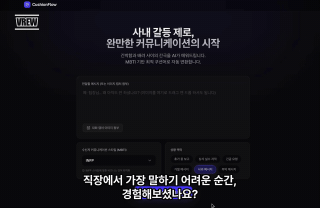

<div align="center">

# 🛡️ CushionFlow

### AI-Powered Workplace Communication Optimizer

**사내 갈등 제로, 완벽한 커뮤니케이션의 시작**

[](https://nextjs.org/)
[](https://ai.google.dev/)
[](https://www.typescriptlang.org/)
[](https://tailwindcss.com/)
[](https://bun.sh/)
[](https://github.com/hyeminLee-project/gemini-hackathon-cushionflow/actions)
[](https://github.com/hyeminLee-project/gemini-hackathon-cushionflow)
[](LICENSE)
[](https://github.com/hyeminLee-project/gemini-hackathon-cushionflow/releases)

[Demo](#-demo) · [Features](#-features) · [Getting Started](#-getting-started) · [Architecture](#-architecture)

</div>

---

## 💡 Why CushionFlow?

> "팀장님이 휴가 중인데… 긴급 보고를 해야 합니다."
>
> "상사의 실수를 지적해야 하는데, 어떻게 말해야 할까요?"

직장에서 **말하기 어려운 순간**은 누구에게나 찾아옵니다. 잘못된 한마디가 관계를 망칠 수 있고, 너무 돌려 말하면 핵심이 전달되지 않습니다.

**CushionFlow**는 수신자의 커뮤니케이션 스타일(MBTI)과 상황 맥락을 분석하여, 관계를 지키면서도 핵심을 전달하는 **최적의 쿠션어(cushion language)**를 제안합니다.

Every workplace has moments where one wrong word can damage a relationship. CushionFlow uses Google Gemini to transform high-stakes messages into optimized communication — tailored to the recipient's personality and context.

---

## ✨ Features

| Feature                        | Description                                                     |
| :----------------------------- | :-------------------------------------------------------------- |
| 🧠 **MBTI-Based Optimization** | 16가지 MBTI 유형별 커뮤니케이션 스타일에 맞춘 메시지 변환       |
| 🎯 **Context-Aware Analysis**  | 휴가 중 보고, 상사 실수 지적, 긴급 요청 등 6가지 상황 맥락 지원 |
| 📊 **Acceptance Score**        | 원본 vs 변환 메시지의 수용도 점수(0–100) 비교                   |
| 🔍 **Multi-Agent Insights**    | 비즈니스·커뮤니케이션 관점의 에이전트 분석 리포트               |
| 🖼️ **Multimodal Input**        | 대화 캡처 이미지 첨부로 맥락 파악 강화                          |
| 📋 **One-Click Copy**          | 제안된 메시지 원클릭 복사                                       |

---

## 🎬 Demo

<div align="center">



[▶ Watch full demo on YouTube](https://youtu.be/TpiD1BH1OB8)

</div>

---

## 🏗️ Architecture

```
┌─────────────────────────────────────────────┐
│                  Client                     │
│          Next.js App Router (React 19)      │
│                                             │
│  ┌─────────┐  ┌──────────┐  ┌───────────┐  │
│  │ Message  │  │   MBTI   │  │  Context  │  │
│  │  Input   │  │ Selector │  │  Picker   │  │
│  └────┬─────┘  └────┬─────┘  └─────┬─────┘  │
│       └──────────────┼──────────────┘        │
│                      ▼                       │
│            POST /api/cushion                 │
├─────────────────────────────────────────────┤
│                  Server                     │
│                                             │
│  ┌──────────────────────────────────────┐   │
│  │         API Route Handler            │   │
│  │  • Input validation                  │   │
│  │  • System prompt builder             │   │
│  │  • Response parsing                  │   │
│  └──────────────┬───────────────────────┘   │
│                 │                            │
│                 ▼                            │
│  ┌──────────────────────────────────────┐   │
│  │      Google Gemini 2.5 Flash         │   │
│  │  • MBTI-aware prompt engineering     │   │
│  │  • Multimodal analysis (text+image)  │   │
│  └──────────────────────────────────────┘   │
└─────────────────────────────────────────────┘
```

---

## 🚀 Getting Started

### Prerequisites

- [Bun](https://bun.sh/) (v1.0+)
- [Google Gemini API Key](https://aistudio.google.com/apikey)

### Installation

```bash
# Clone the repo
git clone https://github.com/hyeminLee-project/gemini-hackathon-cushionflow.git
cd gemini-hackathon-cushionflow

# Install dependencies
bun install

# Set up environment variables
cp .env.example .env.local
# Add your GEMINI_API_KEY to .env.local

# Start dev server
make dev
```

Open [http://localhost:3000](http://localhost:3000) and start cushioning your messages!

### 🐳 Docker

```bash
make docker-up
```

---

## 📋 Commands

| Command          | Description              |
| :--------------- | :----------------------- |
| `make dev`       | Start development server |
| `make build`     | Production build         |
| `make lint`      | Run ESLint               |
| `make typecheck` | TypeScript type check    |
| `make format`    | Prettier formatting      |
| `make docker-up` | Run with Docker          |

---

## 🛠️ Tech Stack

| Category      | Technology                 |
| :------------ | :------------------------- |
| **Framework** | Next.js 16 (App Router)    |
| **Language**  | TypeScript 5 (strict mode) |
| **UI**        | React 19 + Tailwind CSS 4  |
| **AI**        | Google Gemini 2.5 Flash    |
| **Icons**     | Lucide React               |
| **Runtime**   | Bun                        |

---

## 🤝 Contributing

Contributions are welcome! Feel free to open an issue or submit a pull request.

1. Fork the repository
2. Create your feature branch (`git checkout -b feat/amazing-feature`)
3. Commit your changes following [Conventional Commits](https://www.conventionalcommits.org/)
4. Push to the branch (`git push origin feat/amazing-feature`)
5. Open a Pull Request

---

## 📄 License

This project is open source and available under the [MIT License](LICENSE).

---

<div align="center">

**If CushionFlow helps you communicate better, give it a ⭐!**

Made with ❤️ for the [Google Gemini API Developer Competition](https://ai.google.dev/competition)

</div>
